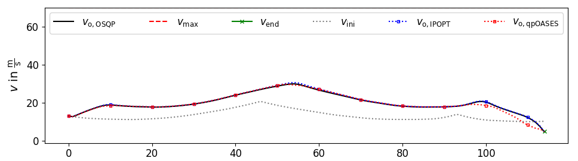

Examples
========

This section describes how to use the velocity_optimization package.

Velocity optimization
*********************

The following class `VelOpt` configures a velocity optimizer object `v_sqp`. `VelOpt` also contains a function
`vsqp_online`that needs the input of e.g., the road curvature `kappa` and the step length between the
discretization points `delta_s`. Additionally, the current vehicle velocity `v_ini`, the initial velocity guess `x0_v`
and the force `F_ini` from the first velocity point (to avoid oscillations in subsequent SQPs) should be provided.

.. code-block:: python

    class VelOpt():

        def __init__(self,
                     m: int):

            self.vsqp_setup(m=m)

        def vsqp_setup(self,
                       m: int):

            self.v_sqp = velocity_optimization.src.VelQP.\
                VelQP(m=m,
                      sid='PerfSQP',
                      params_path=os.path.dirname(os.path.abspath(__file__)) + '/params/',
                      input_path=os.path.dirname(os.path.abspath(__file__)) + '/inputs/veh_dyn_info/',
                      logging_path=os.path.dirname(os.path.abspath(__file__)) + '/logs/')

        def vsqp_online(self,
                        v_ini: float,
                        kappa: np.ndarray,
                        delta_s: np.ndarray,
                        x0_v: np.ndarray,
                        F_ini: float):

            v_op, s_t_op, qp_status = velocity_optimization.src.online_qp.\
                online_qp(velqp=self.v_sqp,
                          v_ini=v_ini,
                          kappa=kappa,
                          delta_s=delta_s,
                          x0_v=x0_v,
                          v_max=np.array([70] * self.v_sqp.m),
                          v_end=5,
                          F_ini=F_ini,
                          s_glob=0)

            return v_op, s_t_op, qp_status

Debugging
*********

Our package come with a powerful debugging tool. Create an empty file and copy the following content to this file.
Adapt `csv_name`, `params_path` and `input_path` to your specific paths. A debug window will show up, plotting the
most important values of the velocity SQP that have been logged.

.. code-block:: python

    import os
    import sys
    import numpy as np

    # custom modules
    vel_opt_path = os.path.dirname(os.path.abspath(__file__))
    sys.path.append(vel_opt_path)
    from velocity_optimization.opt_postproc.vis.VisBenchmarkLogs import VisVP_Logs

    if __name__ == "__main__":

        csv_name = vel_opt_path + '/logs/sqp_perf_2020_06_30_14_59.log'
        csv_name_ltpl = vel_opt_path + '/logs/ltpl/2020_04_09/14_13_12_data.csv'

        # Number of velocity points
        m = 115
        # ID of used velocity planner 'PerfSQP' or 'EmergSQP'
        sid = 'PerfSQP'

        params_path = os.path.dirname(os.path.abspath(__file__)) + '/params/'
        input_path = os.path.dirname(os.path.abspath(__file__)) + '/inputs/veh_dyn_info/'

        # Number of log lines spanning one data block
        log_lines = 4

        # visualize all logs consecutively?
        b_movie = False

        # re-calculate QP from log-input?
        b_run_OSQP = True

        # run qpOASES solver?
        b_calc_qpOASES = True

        # do global plot of states for entire log?
        b_global_plot = True
        glob_lim = np.inf

        # calculate solution from log input using NLP solver IPOPT?
        b_calc_IPOPT = True

        # plot immediately or only solver data replay?
        b_immediate_plot_update = True

        # show plot of solver runtimes?
        b_calc_time_plot = True

        # save plots as tikz files?
        b_save_tikz = True

        vis_options = {'b_movie': b_movie,
                       'b_run_OSQP': b_run_OSQP,
                       'b_calc_qpOASES': b_calc_qpOASES,
                       'b_global_plot': b_global_plot,
                       'glob_lim': glob_lim,
                       'b_calc_IPOPT': b_calc_IPOPT,
                       'b_immediate_plot_update': b_immediate_plot_update,
                       'b_calc_time_plot': b_calc_time_plot,
                       'b_save_tikz': b_save_tikz}

        # --- Set up visualization object
        rL = VisVP_Logs(csv_name=csv_name,
                        csv_name_ltpl=csv_name_ltpl,
                        m=m,
                        sid=sid,
                        log_lines=log_lines,
                        vis_options=vis_options,
                        params_path=params_path,
                        input_path=input_path)

        # --- Start GUI
        rL.vis_log(int(0))

As an example, the optimized velocity (OSQP) is plotted together with the solutions by different solvers,
that are calculated during debugging (depending on the chosen options above). Here, the initial guess, end velocity constraint,
v optimal (IPOPT) and v optimal (qpOASES) are shown:

