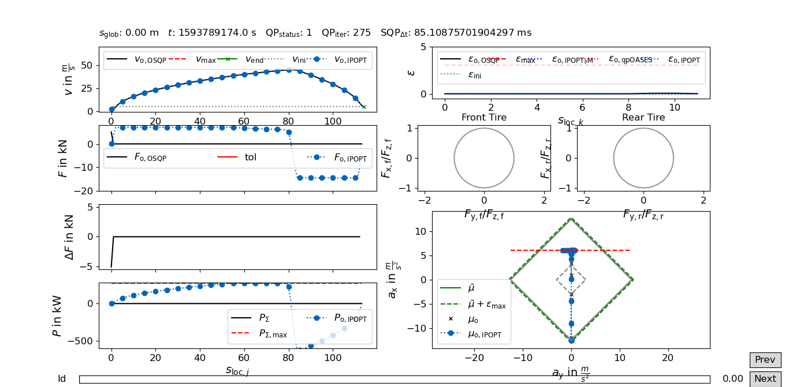

Examples
========

This section describes how to use the velocity_optimization package.

Velocity optimization
*********************

The following class `VelOpt` configures a velocity optimizer object `v_sqp`. `VelOpt` also contains a function
`vsqp_online`that needs the input of e.g., the road curvature `kappa` and the step length between the
discretization points `delta_s`. Additionally, the current vehicle velocity `v_ini`, the initial velocity guess `x0_v`
and the force `F_ini` from the first velocity point (to avoid oscillations in subsequent SQPs) should be provided.

.. code-block:: python

    class VelOpt():

        def __init__(self,
                     m: int):

            self.vsqp_setup(m=m)

        def vsqp_setup(self,
                       m: int):

            self.v_sqp = velocity_optimization.src.VelQP.\
                VelQP(m=m,
                      sid='PerfSQP',
                      params_path=os.path.dirname(os.path.abspath(__file__)) + '/params/',
                      input_path=os.path.dirname(os.path.abspath(__file__)) + '/inputs/veh_dyn_info/',
                      logging_path=os.path.dirname(os.path.abspath(__file__)) + '/logs/')

        def vsqp_online(self,
                        v_ini: float,
                        kappa: np.ndarray,
                        delta_s: np.ndarray,
                        x0_v: np.ndarray,
                        F_ini: float):

            v_op, s_t_op, qp_status = velocity_optimization.src.online_qp.\
                online_qp(velqp=self.v_sqp,
                          v_ini=v_ini,
                          kappa=kappa,
                          delta_s=delta_s,
                          x0_v=x0_v,
                          v_max=np.array([70] * self.v_sqp.m),
                          v_end=5,
                          F_ini=F_ini,
                          s_glob=0)

            return v_op, s_t_op, qp_status

Debugging
*********

Our package come with a powerful debugging tool. Create an empty file and copy the following content to this file.
Adapt `csv_name`, `params_path` and `input_path` to your specific paths. A debug window will show up, plotting the
most important values of the velocity SQP that have been logged. The following combinations of solvers and vehicle
models are available:
IPOPT + PM (Diamond + Circle + var fric + var power)
IPOPT + KM (Diamond + Circle + var fric + var power)
IPOPT + DM (Circles + var power)
IPOPT + FW (Circles + var power)

qpOASES + PM (Diamond + Circle + var fric + var power)

.. code-block:: python

    import os
    import sys
    import numpy as np

    # custom modules
    vel_opt_path = os.path.dirname(os.path.abspath(__file__))
    sys.path.append(vel_opt_path)
    from velocity_optimization.opt_postproc.vis.VisBenchmarkLogs import VisVP_Logs

    if __name__ == "__main__":

        csv_name = vel_opt_path + '/velocity_optimization/logs/sqp_perf_2020_06_08_09_15.log'
        csv_name_ltpl = vel_opt_path + '/velocity_optimization/logs/sqp_perf_2020_06_08_09_15.log'

        # Number of velocity points
        m = 90

        # ID of used velocity planner 'PerfSQP' or 'EmergSQP'
        sid = 'PerfSQP'

        params_path = os.path.dirname(os.path.dirname(os.path.abspath(__file__))) + '/params/'
        input_path = os.path.dirname(os.path.dirname(os.path.abspath(__file__))) + '/inputs/'

        # Number of log lines spanning one data block
        log_lines = 4

        # visualize all logs consecutively?
        b_movie = False
        # re-calculate QP from log-input?
        b_run_OSQP = True

        # run qpOASES solver?
        b_calc_qpOASES = True

        # Constant(True)/Variable(False) Power
        b_con_power = True

        # Choose Starting Idx of Log-File
        b_idx = 0
        # Plot Race Course with planning horizon
        b_plot_course = False
        # Select Legend Item (Model, Solver, Friction, Alpha)
        b_vis_model_name = False
        b_vis_solver_name = True
        b_vis_fric_model = False
        b_vis_alpha = False

        # do global plot of states for entire log?
        b_global_plot = False
        glob_lim = np.inf

        # plot immediately or only solver data replay?
        b_immediate_plot_update = True

        # show plot of solver runtimes?
        b_calc_time_plot = True

        # save plots as tikz files?
        b_save_tikz = False

        # visulaization options
        vis_options = {'b_movie': b_movie,
                       'b_run_OSQP': b_run_OSQP,
                       'b_calc_qpOASES': b_calc_qpOASES,
                       'b_con_power': b_con_power,
                       'b_idx': b_idx,
                       'b_vis_model_name': b_vis_model_name,
                       'b_plot_course': b_plot_course,
                       'b_vis_solver_name': b_vis_solver_name,
                       'b_vis_fric_model': b_vis_fric_model,
                       'b_vis_alpha': b_vis_alpha,
                       'b_global_plot': b_global_plot,
                       'glob_lim': glob_lim,
                       'b_immediate_plot_update': b_immediate_plot_update,
                       'b_calc_time_plot': b_calc_time_plot,
                       'b_save_tikz': b_save_tikz}

        # Define solver options
        sol_options = {'solver1': {'Model': "PM",               # PM (Punktmasse), KM (kinematisches Einpsurmodell),
                                                                # DM (dynamisches Einspurmodell), FW (Zweispurmodell,
                                                                # only for IPOPT available)
                                   'Solver': "IPOPT",            # IPOPT, OSQP, MOSEK, qpOASES
                                   'Friction': "Diamond",        # Circle, Diamond (only for PM and KM)
                                   'VarFriction': True,        # True, False
                                   'VarPower': False,           # True, False
                                   'Slack': True,              # True, False
                                   'Alpha': 0.1,                # 0 < alpha < 1 (only for OSQP, qpOASES and Mosek necessary)
                                                                # alpha = 0.1 recommended for DM
                                   }
                       }

        # --- Set up visualization object
        rL = VisVP_Logs(csv_name=csv_name,
                        csv_name_ltpl=csv_name_ltpl,
                        m=m,
                        sid=sid,
                        log_lines=log_lines,
                        vis_options=vis_options,
                        params_path=params_path,
                        input_path=input_path,
                        sol_options=sol_options)

        # --- Start GUI
        rL.vis_log(int(0))

As an example, the optimized velocity (OSQP) is plotted together with the solutions by different solvers,
that are calculated during debugging (depending on the chosen options above). Here, the initial guess, end velocity constraint,
v optimal (IPOPT) and v optimal (qpOASES) are shown:

.. image:: DebugWindow.png
   :width: 600

In addition, plots of the the driving force, motor power, slack variables and acceleration are visualized in the GUI:

There are several options to select for the visualization which are described in the following table. These values are
saved in the vis_options dictionnary.

.. list-table:: Visualization Options (Default values in brackets)
   :widths: 25 10 65
   :header-rows: 1

   * - Name
     - Value
     - Description
   * - csv_name, csv_name_ltpl
     - Path
     - Path to the log-file or csv-file of the input data
   * - m
     - > 1 (115)
     - Length of the planing horizon. Depends on the data of the log-file/csv-data.
   * - sid
     - PerfSQP/Emerg/SQP
     - Choose if a velocity profile is calculated for a performance path or an emergency path.
   * - params_pat
     - Path
     - Path to the directory of the visulaization paramter
   * - input_path
     - Path
     - Path to the directory of the input data (variable power/friction data)
   * - log_lines
     - Int (4)
     - Number of lines in the log-file which belong to a single planing horizon. See more information at the description of the log-file structure.
   * - b_movie
     - True/False
     - Choose if all optimization problems is solved without stopping between different planning horizons (True) or not (False).
   * - b_run_OSQP
     - True/False
     - Choose if the optimization problem is solved with the OSQP solver (reference solver) again (True) or not (False)
   * - b_cacl_qpOASES
     - True/False
     - Choose if the optimization problem is solved with the solver qpOASES (True) or not (False).
   * - b_con_power
     - True/False
     - Choose if a constant value for the max. power is used (True) or not(False).
   * - b_idx
     - Int (0)
     - Select a specific planning horizon to be plotted in the GUI. The nuber of the planning horizon should be multiplied by the number of log_lines. Choose 0 as the default value.
   * - b_plot_course
     - True/False
     - Create a plot of the racetrack with the choosen index (b_dix) of the planning horizon (True) or not (False).
   * - b_vis_solver_name
     - True/False
     - Select the solver name as the subindex of the legend entrys (True) or not.
   * - b_vis_model_name
     - True/False
     - Select the driving dynamics model name as the subindex of the legend entrys (True) or not.
   * - b_vis_fric_model
     - True/False
     - Select the name of the friction model as the subindex of the legend entrys (True) or not.
   * - b_vis_alpha
     - True/False
     - Select the value of alpha as the subindex of the legend entrys (True) or not.
   * - b_global_plot
     -
     -
   * - b_immediate_plot_update
     - True/False
     - Update the plots in the GUI after solving the optimization problem for each planning horizon (True) or not (False).
   * - b_calc_time_plot
     - True/False
     - Show and update the plot of the calculation time
   * - b_save_tikz
     - True/False
     - Save (True) the plot of the calcultaion time or not (False).

The configuration of the solver can be selected in the sol_options dictionnary. Attention, no every combination is possible.
E.g. the four-wheel model can only be solved with the IPOPT solver.

.. list-table:: Visualization Options (Default values in brackets)
   :widths: 25 10 65
   :header-rows: 1

   * - Name
     - Value
     - Description
   * - Model
     - PMM/kESM/dESM/ZSM
     - Select the vehicle dynamic model as the point-mass model (PMM), kinematic bicycle model (kESM), dynamic bicycle model (dESM) or four-wheel model (ZSM, only in combination with the solver IPOPT).
   * - Solver
     - IPOPT/OSQP/qpOASES/MOSEK
     - Select betweeen the solver IPOPT (Nonlinear interior point) and the SQP solver OSQP (Alternating direction method of multipliers), MOSEK (Interior Point) and qpOASES (Active-Set).
   * - Friction
     - Circle/Diamond
     - Select between the friction circle and friction diamond as the acceleration constraint for the PMM and kESM.
   * - VarFriction
     - True/False
     - Choose if the optimization problem is solved with a variable friction along the track (True) or not (False).
   * - VarPower
     - True/False
     - Choose if variable power constraint is uses to solve the optimization problem (True) or not (False).
   * - Slack
     - True/False
     - Choose if slack variables are used in the optimization (True) or not (False). Only available for the PMM and kESM in combination with the solver IPOPT.
   * - Alpha
     - 0-1 (1)
     - Select the initial step length for the SQP methods (OSQP, MOSEK, qpOASES). For the PMM and kESM a value betweeen 0,4 and 1 is recommended. For the dESM alpha should be choosen to 0,1.

.. code-block:: python

    sol_options = {'solver1': {'Model': "PM",               # PM (Punktmasse), KM (kinematisches Einpsurmodell),
                                                            # DM (dynamisches Einspurmodell), FW (Zweispurmodell,
                                                            # only for IPOPT available)
                               'Solver': "OSQP",            # IPOPT, OSQP, MOSEK, qpOASES
                               'Friction': "Circle",        # Circle, Diamond (only for PM and KM)
                               'VarFriction': True,        # True, False
                               'VarPower': False,           # True, False
                               'Slack': True,              # True, False
                               'Alpha': 0.4,                # 0 < alpha < 1 (only for OSQP, qpOASES and Mosek necessary)
                                                            # alpha = 0.1 recommended for DM
                               },
                   'solver2': {'Model': "FW",
                               'Solver': "IPOPT",
                               'Friction': "Diamond",
                               'VarFriction': False,
                               'VarPower': True,
                               'Slack': True,
                               'Alpha': 1,

                               }
                   }

In the code above, two configurations are set to solve the optimization problem. Solver 1 contains the point-mass model (PMM)
as the vehicle dynamic model, the solver OSQP and a circle to constraint the acceleration at the CoG. Variable Friction coefficients
along the track are used but no variable power. In order to improe the calculation time, slack variables are used, too.
The step length of the SQP algorithm is set to 0.4. Solver 2 uses a four-wheel model (FW) to describe the vehicle dynamics in
combination with the solver IPOPT (attention: IPOPT is the only implemented solver to use the FW model). The setting of
the friction model has no influence on the optimization problem using the FW model. Instead of variable friction coefficients,
variable power is used along the track. Slack variable are set True but have no influence on this model, since the FW model
is implemented without slack variables, yet. The step length alpha is used for SQP methods. Since IPOPT is a nonlinear solver,
this parameter is not used for this solver.
At this example, you can see that not every parameter is needed for every configuration, so better check the description behind
the parameters.
